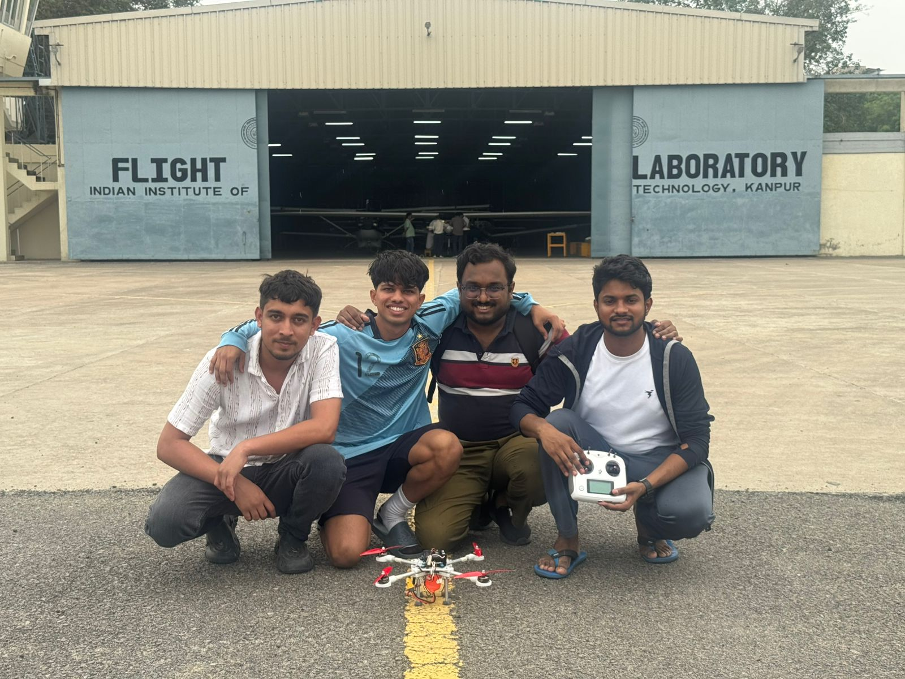
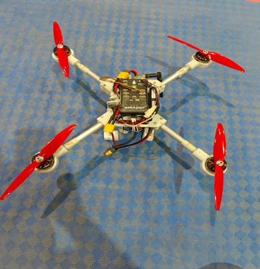
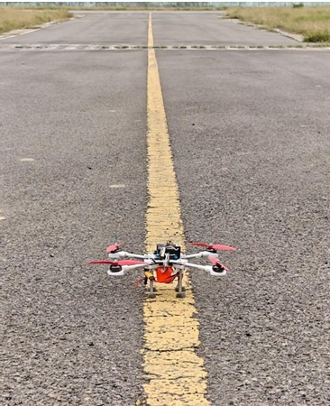

# 🚁 Quadrotor Design
## Design, Optimization, and Fabrication of a Quadrotor


**Conceptual design, optimization, and fabrication of a 300 g payload / 20 min endurance quadrotor**

A MATLAB sizing tool built on Blade Element Momentum Theory coupled to empirical component-weight regressions, taken from mission requirements through parametric optimization, hardware selection, CAD, fabrication, and bench validation.

Course project — AE630, Autonomous Unmanned Aerial Systems.

**Supervisor:** Prof. Abhishek, 
Department of Aerospace Engineering, Helicopter and VTOL Laboratory
Indian Institute of Technology Kanpur, Kanpur 208016, India



---

## 🛩️ Mission

| Requirement | Value |
|---|---|
| Payload | 300 g |
| Hover endurance | 20 min |
| Conditions | Sea level, ρ = 1.225 kg/m³ |
| Rotors | Fixed pitch, constant chord |
| Twist distribution | θ(r) = θ₀ − 17r (deg) |
| Target disc loading | 40–90 N/m² |
| Motor efficiency | η_m = 0.80 |

---

## ⚙️ Approach

The design closes on gross takeoff weight through a fixed-point iteration. Every component mass depends on power, power depends on thrust, and thrust depends on the weight you are trying to find — so the loop is run to convergence for every candidate configuration in a parametric sweep.

```
        ┌─────────────────────────────────────────┐
        │  GTOW guess = 3 × payload = 900 g       │
        └────────────────────┬────────────────────┘
                             ▼
              T_hover = W/4  ·  T_design = 2·T_hover
                             ▼
              ┌──────────────────────────────┐
              │  BEMT solver                 │
              │  → C_T, C_P, Ω, P_hover      │
              └──────────────┬───────────────┘
                             ▼
              Battery energy = P_elec × endurance
                             ▼
        ┌─────────────────────────────────────────┐
        │  Empirical weight regressions           │
        │  rotor · motor · ESC · battery · frame  │
        └────────────────────┬────────────────────┘
                             ▼
                  GTOW_new = Σ components
                             ▼
              |ΔW| < 5 g ?  ──no──► relax & repeat
                             │yes
                             ▼
                       converged design
```

**Key modeling note.** With fixed-pitch blades and a linear lift-curve slope, C_T is a property of blade geometry alone and does not vary with rotor speed. This lets the BEMT solver run **once** per geometry at a reference RPM; hover conditions then follow analytically from T ∝ Ω² and P ∝ Ω³. That is what makes a full six-dimensional sweep tractable — thousands of candidate designs converge in seconds instead of hours.

---

## 📐 Design space

Six parameters were swept, with the loop run to convergence at every point:

| Parameter | Range |
|---|---|
| Rotor radius | 0.09 – 0.25 m |
| Root pitch θ₀ | 18° – 26° |
| Aspect ratio (R/c) | 6 – 16 |
| Blades per rotor | 2, 3, 4 |
| Battery cells | 3S, 4S, 6S |
| Motor Kv | 1000 – 3000 |

Note that solidity is **not** independent: σ = N_b·c/πR and AR = R/c give σ = N_b/(π·AR). Only two of the three may be chosen freely.

### Candidate configurations

| | Config 1 | Config 2 | Config 3 |
|---|---|---|---|
| Radius (m) | 0.09 | 0.09 | 0.09 |
| θ₀ (deg) | 26 | 20 | 22 |
| Aspect ratio | 6 | 9 | 8 |
| Blades | 2 | 2 | 2 |
| Cells | 3S | 4S | 4S |
| **GTOW (kg)** | **0.816** | **1.257** | **0.998** |
| Battery (kg) | 0.164 | 0.399 | 0.253 |
| Frame (kg) | 0.225 | 0.338 | 0.274 |
| Hover RPM | 7 849 | 16 717 | 12 157 |
| Kv | 3000 | 1800 | 1300 |
| P_max/motor (W) | 47.3 | 117.9 | 72.3 |

**Config 1** is the mathematical optimum and physically unbuildable — a 12 g motor lacks the stator volume to drive a 7-inch propeller without thermal failure. **Config 2** trades into a punishing 16 700 RPM hover. 
**Config 3** is the realistic middle ground and became the basis for hardware selection.


---

## 🔧 As-built vehicle

Component availability drove the final build away from the theoretical optimum.

| Component | Selection | Qty | Mass |
|---|---|---|---|
| Motor | Emax ECOII-2807, 1300 Kv | 4 | 216 g |
| Propeller | Gemfan Flash 7042 (7.0 × 4.2) | 4 | 24 g |
| ESC | Holybro Tekko32 F4 4-in-1, 50 A | 1 | 13.8 g |
| Battery | Molicel INR21700-P45B 4S1P, 4500 mAh | 1 | 313 g |
| Frame | Custom, aluminium tube arms | 1 | 220 g |
| Avionics & wiring | Pixhawk, GPS, harness | — | 150 g |
| Payload | — | — | 300 g |
| **All-up weight(without payload)** | | | **≈ 937 g** |
| **All-up weight(with payload)** | | | **≈ 1237 g** |

Frame: symmetric X configuration, 3 mm sandwich plates with integrated arm clamps, 12 mm OD aluminium tube arms, gusseted motor mounts. Load path runs motor → mount → arm → clamp → base plate → centre structure.

---

## 📊 Results

Bench thrust testing against the built vehicle:

| Quantity | Predicted (Config 3) | Measured |
|---|---|---|
| Hover efficiency | ≈ 9.8 g/W | 5.41 g/W |
| Hover RPM | 12 157 | 8 440 |
| Hover power (total) | ≈ 102 W | ≈ 228 W |
| Endurance | 20+ min | **≈ 15 min** |

**The vehicle did not meet the 20-minute requirement, and the gap is instructive.**

Three causes account for most of it:

1. **Blade geometry mismatch.** Config 3 models AR = 8 at R = 0.09 m, giving an 11.25 mm chord and σ = 0.080. The Gemfan 7042 actually fitted has roughly a 15–18 mm chord, σ ≈ 0.13. A narrower modeled blade needs higher RPM for the same thrust — which is exactly the 12 157 vs 8 440 RPM discrepancy.

2. **Optimistic aerodynamics.** The BEMT solver uses a constant profile drag coefficient C_d0 = 0.01 and a linear lift curve with no stall. At tip Reynolds numbers of 10⁴–10⁵ this understates profile power, and the chosen θ₀ sits in the high-loading regime where the reference paper explicitly flags BEMT correlation degrading.

3. **Weight growth from procurement.** The intended 41 g motors were unavailable; the 54 g substitutes added 52 g of propulsion mass, which cascades through frame and battery sizing. Final disc loading reached ≈ 120 N/m², well above the 40–90 N/m² band the mission specified — and high disc loading is directly a hover-efficiency penalty.

Net: the sizing model was roughly **1.8× optimistic on hover efficiency**. Closing that gap requires low-Reynolds sectional airfoil tables in place of constant coefficients, and a solidity input matched to the propeller actually procurable rather than a free sweep variable.

---

## 📁 Repository structure

```
.
├── src/
│   ├── uav_sizing.mlx              Weight convergence loop + parametric sweep
│   ├── bemt_gaussian_quad.mlx      BEMT solver, 6-point Gaussian quadrature
│   └── bemt_trapezoidal.mlx        BEMT solver, trapezoidal integration
├── results/
│   └── design_Data.csv             Full converged design table from the sweep
├── cad/
│   ├── Quadcopter assembly.jpg
│   ├── top plate.jpg               ├── top plate with dim.jpg
│   ├── bottom plate.jpg            ├── bottom plate with dim.jpg
│   ├── arms.jpg                    ├── arms with dim.jpg
│   └── motor mount.jpg             └── motor mount with dim.jpg
├── media/
│   ├── quadcopter_assembeled_v1.jpg
│   ├── quadcopter_assembeled_v2.jpg
│   ├── team3_ae630.jpeg
│   ├── initial_testing.mp4
│   ├── testing_without_payload.mp4
│   └── testing_with_payload.mp4
├── hardware/                       (BOM — not yet added)
├── LICENSE
└── README.md
```

---

## 💻 Running the code

Requires MATLAB R2020b or newer. No additional toolboxes. All files are MATLAB
Live Scripts (`.mlx`) — open them in the MATLAB editor and use **Run** to execute
section by section with inline output and figures.

| File | Purpose |
|---|---|
| `src/uav_sizing.mlx` | Main design tool. Runs the weight-convergence loop across the full parameter sweep and writes `results/design_Data.csv`. |
| `src/bemt_gaussian_quad.mlx` | BEMT solver using 6-point Gaussian quadrature over 10 blade elements. |
| `src/bemt_trapezoidal.mlx` | Same solver using trapezoidal integration (200+ points), for cross-checking the quadrature result. |

**To reproduce the design study:**

1. Open `src/uav_sizing.mlx`
2. Adjust the sweep ranges in the *Parameter Sweep Setup* section if desired
3. **Run All** — the sweep converges every candidate configuration and prints the
   optimal design specification table
4. Results are written to `results/design_Data.csv` and the sensitivity plots are
   generated inline

**To check the BEMT solver independently:** run either `bemt_gaussian_quad.mlx` or
`bemt_trapezoidal.mlx`. Both take the same rotor geometry and return thrust, power,
and the spanwise inflow, pitch, and loading distributions. Agreement between the two
integration schemes confirms adequate spanwise resolution.

> **Note on GitHub rendering:** `.mlx` files are binary and will not preview in the
> browser. Download and open them in MATLAB, or export to `.m` if you want the code
> readable directly on GitHub.

---

## 📸 Media

### CAD table

| Assembly | Bottom plate | Motor mount |
|---|---|---|
|  |  |  |

### Media table

| | |
|---|---|
|  |  |
| Assembled vehicle | Alternate view |

Test footage: [initial testing](media/initial_testing.mp4) · [without payload](media/testing_without_payload.mp4) · [with payload](media/testing_with_payload.mp4)

---

## 📚 References

1. Winslow, J., Hrishikeshavan, V., and Chopra, I., "Design Methodology for Small-Scale Unmanned Quadrotors," *Journal of Aircraft*, 2018. [DOI: 10.2514/1.C034483](https://doi.org/10.2514/1.C034483)
2. Leishman, J. G., *Principles of Helicopter Aerodynamics*, 2nd ed., Cambridge University Press, 2006.
3. Bershadsky, D., Haviland, S., and Johnson, E. N., "Electric Multirotor Propulsion System Sizing for Performance Prediction and Design Optimization," AIAA SciTech 2016.

---

## 👥 Team

Group 3 — AE630, Department of Aerospace Engineering, IIT Kanpur

| Name | Roll No. |
|---|---|
| Md Tahseen Aslam | 251010069 |
| Divyansh Singh | 251010064 |
| Magesvar V R | 251010068 |
| Swagat Kumar Jena | 251010073 |
| Pradeep Kumar | 251010071 |

## License

Code released under the MIT License. See [LICENSE](LICENSE).
CAD renders, photographs, and the written report are © the authors; reuse by permission.
